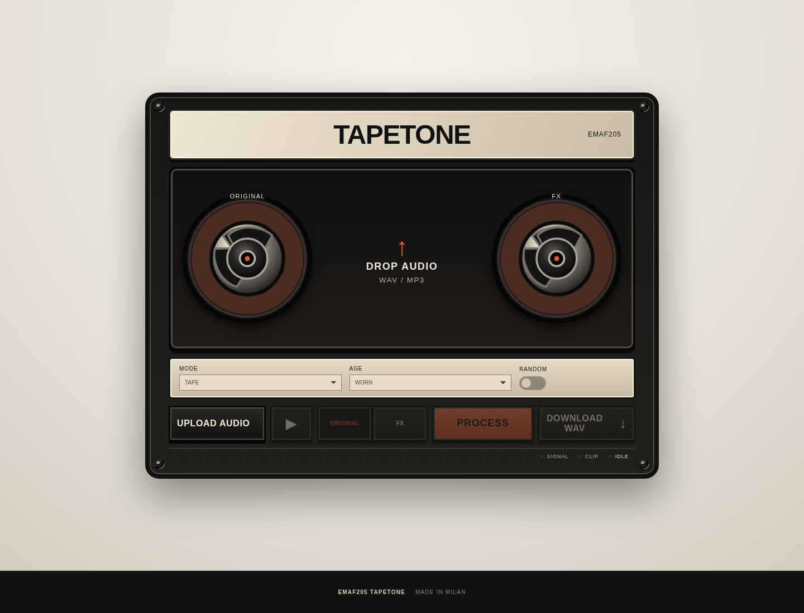
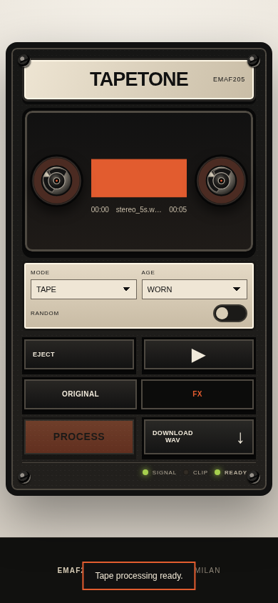

# EMAF205 TAPETONE

**Vintage tape character directly in your browser.**

TAPETONE is a static browser-based audio processor for WAV and MP3 files. It is designed around a deliberately small workflow: upload, choose a tape character, process, compare Original / FX, and export a 24-bit WAV.



## Features

- Browser-side audio processing
- Tape, Cassette, Boombox and Recorder characters
- New, Worn and Dead age profiles
- Randomized but controlled tape variation
- Loudness-compensated Original / FX comparison
- 24-bit WAV export
- Adaptive file-duration limits for mobile devices
- Responsive phone, tablet and desktop interface
- Installable PWA over HTTPS / localhost
- Offline core app after caching
- No account or paid audio API required

## Mobile



The interface is designed for touch. Processing limits are deliberately more conservative on phones and tablets to reduce memory failures.

## How to use

1. Upload a WAV or MP3 file.
2. Select a **Mode** and **Age**.
3. Optionally load a **Random** tape variation.
4. Press **Process**.
5. Compare **Original** and **FX**.
6. Download the processed **24-bit WAV**.

## Modes

| Mode | Character |
|---|---|
| Tape | Warm, balanced and subtle |
| Cassette | Darker, compressed and unstable |
| Boombox | Narrower, mid-forward and gritty |
| Recorder | Reduced bandwidth and strongly lo-fi |

## Privacy

Audio processing is performed client-side. This static application does not intentionally send uploaded audio to an external audio-processing service.

## Run locally

Open `index.html` directly for basic local use, or run a local static server for full PWA behavior:

```bash
python3 -m http.server 8080
```

Then open `http://localhost:8080`.

## PWA

PWA installation requires a secure context such as HTTPS or localhost. The service worker caches only application assets; it does not intentionally cache user audio files.

## Project structure

```text
assets/                 App graphics and PWA icons
guides/                 SEO / help pages
screenshots/            README images
app.js                   DSP, player, export and state logic
styles.css               Responsive interface
index.html               Main static app
manifest.webmanifest     PWA manifest
service-worker.js        Offline app-shell cache
robots.txt               Crawler policy
sitemap.xml              Deployment placeholder
```

## Links

- Free Audio Apps: http://emaf205.com/audio
- Premium Collection: http://emaf205.com/audio_pro

## Credits

**Made in Milan by EmaF205.**

## License

Copyright © 2026 EmaF205. All rights reserved. See `LICENSE`.
